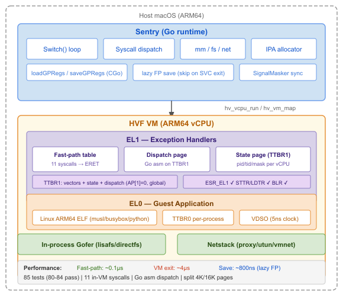
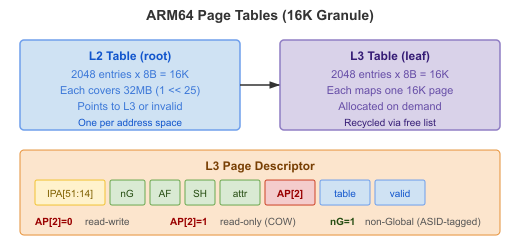
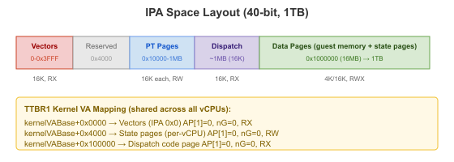
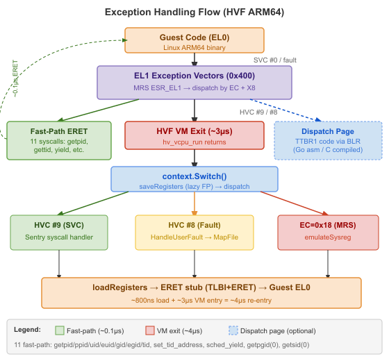
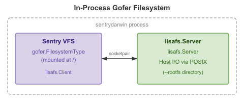
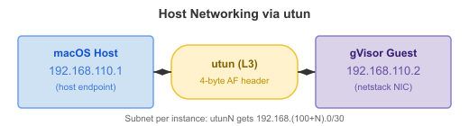

# gVisor macOS Port

> **Status: Functional**
>
> gVisor runs on macOS Apple Silicon via Hypervisor.framework. Alpine
> Linux boots with full shell, networking, package management, and
> multi-CPU support. Packages install from Alpine repos over HTTP.

| Feature | Status |
|---------|--------|
| HVF platform (Hypervisor.framework) | Working |
| ARM64 page tables (16K, per-MM, COW) | Working |
| Fork/exec with copy-on-write | Working |
| Signal delivery (SIGURG, SIGINT, etc.) | Working |
| Multi-CPU (14 vCPUs, GOMAXPROCS=22) | Working |
| Gofer filesystem (host dir passthrough) | Working |
| Symlink resolution (busybox) | Working |
| Alpine Linux 3.21.3 | Working (82+ commands) |
| TCP/UDP (loopback + internet) | Working |
| Host networking (utun + userspace proxy) | Working (requires root) |
| DNS resolution (host system DNS) | Working |
| HTTP downloads (large files) | Working (477KB verified) |
| HTTP server (Go, loopback self-test) | Working |
| Interactive terminal (PTY) | Working |
| /proc/self/exe (fork+re-exec) | Working |
| OpenSSL/libcrypto (apk, curl) | Working |
| Go static binaries (fmt, os, crypto) | Working |
| /proc/cpuinfo (Apple Silicon features) | Working |
| Package install (`apk add`) | Working (54+ packages from main+community) |
| Dynamically-linked packages | Working (jq, gawk, bc, less, tree, file, grep, sed, lua, sqlite, etc.) |
| OCI / Docker image support | Not implemented |

Run Linux containers on macOS Apple Silicon using gVisor's sentry kernel and Apple's Hypervisor.framework.

```
$ sentrydarwin --rootfs alpine-rootfs /bin/sh -c 'uname -a'
Linux gvisor-darwin 4.4.0 #1 SMP Sun Jan 10 15:06:54 PST 2016 aarch64 Linux

$ sudo sentrydarwin --net --rootfs alpine-rootfs /bin/sh -c 'ping -c1 192.168.110.1'
64 bytes from 192.168.110.1: seq=0 ttl=64 time=2.391 ms
```

## Quick Start

```bash
# Build
bazel build --config=hvf //cmd/sentrydarwin:sentrydarwin

# Sign with Hypervisor entitlement
cat > /tmp/hvf.plist << 'EOF'
<?xml version="1.0" encoding="UTF-8"?>
<!DOCTYPE plist PUBLIC "-//Apple//DTD PLIST 1.0//EN" "http://www.apple.com/DTDs/PropertyList-1.0.dtd">
<plist version="1.0"><dict>
  <key>com.apple.security.hypervisor</key><true/>
</dict></plist>
EOF
cp bazel-bin/cmd/sentrydarwin/sentrydarwin_/sentrydarwin ./sentrydarwin
codesign --force --sign - --entitlements /tmp/hvf.plist ./sentrydarwin

# Download Alpine Linux
mkdir alpine-rootfs
curl -sL https://dl-cdn.alpinelinux.org/alpine/v3.21/releases/aarch64/alpine-minirootfs-3.21.3-aarch64.tar.gz \
  | tar xz -C alpine-rootfs

# Run
./sentrydarwin --rootfs alpine-rootfs /bin/sh -c 'ls /; cat /etc/os-release'

# With host networking (requires root)
sudo ./sentrydarwin --net --rootfs alpine-rootfs /bin/sh -c 'ping -c3 $(cat /proc/net/dev | grep utun | head -1 | sed "s/\.2/.1/g")'
```

Or use the `macsc` wrapper which handles build + sign automatically:

```bash
cmd/macsc/macsc.sh build
cmd/macsc/macsc.sh pull alpine
cmd/macsc/macsc.sh run --rootfs _tmp/alpine-rootfs /bin/sh -c 'echo hello'
```

### Flags

| Flag | Description |
|------|-------------|
| `--rootfs <dir>` | Host directory to use as guest root filesystem (via gofer) |
| `--net` | Enable host networking via utun (requires root) |
| `--strace` | Enable system call tracing |

## Usage Examples

### Basic commands

```console
$ sentrydarwin --rootfs alpine-rootfs /bin/sh -c 'uname -a'
Linux gvisor-darwin 4.4.0 #1 SMP Sun Jan 10 15:06:54 PST 2016 aarch64 Linux

$ sentrydarwin --rootfs alpine-rootfs /bin/sh -c 'cat /etc/alpine-release'
3.21.3

$ sentrydarwin --rootfs alpine-rootfs /bin/sh -c 'id'
uid=0(root) gid=0(root)

$ sentrydarwin --rootfs alpine-rootfs /bin/sh -c 'ls /'
bin dev etc home lib media mnt opt proc root run sbin srv sys tmp usr var
```

### Shell scripts with fork, exec, and pipes

```console
$ sentrydarwin --rootfs alpine-rootfs /bin/sh -c '
    echo "Files in /bin: $(ls /bin | wc -l)"
    echo "Hello" | tr a-z A-Z
    seq 1 5 | awk "{s+=\$1} END{print \"Sum:\", s}"
'
Files in /bin: 82
HELLO
Sum: 15
```

### File I/O

```console
$ sentrydarwin --rootfs alpine-rootfs /bin/sh -c '
    echo "gVisor on macOS" > /tmp/test.txt
    cat /tmp/test.txt
    wc -c /tmp/test.txt
'
gVisor on macOS
16 /tmp/test.txt
```

### Host networking (requires root)

```console
$ sudo sentrydarwin --net --rootfs alpine-rootfs /bin/sh -c '
    ifconfig | grep "inet addr:192"
    ping -c 2 192.168.110.1
'
          inet addr:192.168.110.2  Mask:255.255.255.252
PING 192.168.110.1 (192.168.110.1): 56 data bytes
64 bytes from 192.168.110.1: seq=0 ttl=64 time=2.391 ms
64 bytes from 192.168.110.1: seq=1 ttl=64 time=0.297 ms
```

### Syscall tracing

```console
$ sentrydarwin --strace --rootfs alpine-rootfs /bin/sh -c 'echo hello' 2>&1 | grep -E "write|exit"
[   1:   1] sh X write(0x1, ..., 0x6) = 6
[   1:   1] sh E exit_group(0x0)
```

### Using macsc wrapper

```console
$ cmd/macsc/macsc.sh build           # build + sign with HVF entitlement
$ cmd/macsc/macsc.sh pull alpine     # download Alpine Linux rootfs
$ cmd/macsc/macsc.sh run --rootfs _tmp/alpine-rootfs /bin/sh -c 'uname -m'
aarch64
```

### Running Go binaries directly (no rootfs needed)

```console
$ sentrydarwin ./my-static-linux-arm64-binary arg1 arg2
```

## Architecture



The port replaces gVisor's KVM platform with a Hypervisor.framework (HVF) platform. The guest runs at EL1 inside an HVF virtual machine. The sentry intercepts syscalls via exception vectors and handles them in Go, just like on Linux.

## Platform: Hypervisor.framework (HVF)

### Source Files

| File | Purpose |
|------|---------|
| `pkg/sentry/platform/hvf/hvf.go` | Platform type, constructor, `platform.Register("hvf")` |
| `pkg/sentry/platform/hvf/machine.go` | vCPU pool management, shared VM resources |
| `pkg/sentry/platform/hvf/context.go` | `Switch()` loop: run vCPU, handle exits |
| `pkg/sentry/platform/hvf/address_space.go` | Per-MM address spaces, `MapFile`/`Unmap` |
| `pkg/sentry/platform/hvf/pagetable.go` | ARM64 L2/L3 page tables, COW support |
| `pkg/sentry/platform/hvf/vcpu_arm64.go` | Register save/restore, exception vectors, PSTATE translation |
| `pkg/sentry/platform/hvf/ipa_allocator.go` | IPA space management, page table page recycling |

### Guest Execution Model

The guest runs at **EL0** (ARM64 user mode) with the sentry's exception vectors at EL1. The vCPU enters at EL1 to execute a TLB flush + ERET stub, which transitions to EL0 at the guest's PC. When the guest executes SVC, it traps through the lower-EL sync vector (offset 0x400, HVC #8) to the hypervisor.

```
 Entry:  CPSR=EL1h → ERET stub (TLBI+DSB+ISB+ERET) → EL0 at ELR_EL1
 Save:   SP from SP_EL0, PC from ELR_EL1, Pstate from SPSR_EL1
 Load:   SPSR_EL1 = Pstate & 0xF0000000 (NZCV + EL0t, no DAIF)
```

Page table entries use AP[2:1]=01 (EL1+EL0 RW) for writable pages and AP[2:1]=11 (EL1+EL0 RO) for read-only/COW pages. The dual-TTBR setup (TCR_EL1 with EPD1=0) provides TTBR0 for per-process guest memory and TTBR1 for the future sentry kernel mapping.

### Page Tables



### IPA (Intermediate Physical Address) Space



### Exception Handling



Sigreturn trampoline at IPA 0x804:
```asm
 0x804:  MOV X8, #139     // __NR_rt_sigreturn
 0x808:  SVC #0            // trap to sentry
```

### Copy-on-Write Fork

When `fork()` is called:

1. A new `addressSpace` with new `guestPageTable` is created
2. Parent's PMAs are marked `needCOW=true`, write permissions removed
3. Parent's writable page table entries are unmapped via `unmapASLocked`
4. Child's PMA `internalMappings` are cleared to force slow-path IO
5. Child's page table starts empty (except vectors at VA 0)

On first access by the child:
- Guest faults (no L3 entry) -> `HandleUserFault` -> `mapASLocked` -> `MapFile`
- The IPA allocator returns the existing IPA for the shared host page
- Page table entry created with AP[2]=1 (read-only) if COW

On write to a COW page:
- Permission fault -> `HandleUserFault` -> `breakCopyOnWriteLocked`
- New physical page allocated, data copied
- Page table entry updated with AP[2]=0 (writable)

## Gofer Filesystem

The gofer provides host directory passthrough via the lisafs protocol. An in-process lisafs server runs in a goroutine, connected to the sentry via a Unix socketpair.



### Linux API → macOS Mapping

Every Linux-specific syscall/API used by gVisor was mapped to a macOS equivalent. Compat files use `_darwin.go` / `_linux.go` suffixes.

#### Filesystem & File Operations

| Linux API | macOS Replacement | Notes |
|-----------|-------------------|-------|
| `/proc/self/fd/N` | `fcntl(F_GETPATH)` + `open()` | FD reopen; falls back to `dup()` for dirs |
| `O_PATH` | `O_SYMLINK\|O_NOFOLLOW` or `O_RDONLY` | No O_PATH on macOS |
| `AT_EMPTY_PATH` | `fchown(fd)` directly | macOS doesn't support empty path |
| `readlinkat(fd, "")` | `fcntl(F_GETPATH)` + `readlink()` | Empty name not supported |
| `getdents64(2)` | `getdirentries(2)` | Different dirent format, header size=21 |
| `fallocate(2)` | `ENOTSUP` | No equivalent on macOS |
| `mknodat(2)` | `open(O_CREAT\|O_EXCL)` | Special files return ENOTSUP |
| `statx(2)` | `fstat(2)` | statx doesn't exist on macOS |
| `dup3(2)` | `dup(2)` + `fcntl(F_SETFD)` | Can't atomically dup to specific FD |
| `tee(2)` / `splice(2)` | `ENOTSUP` | Not available on macOS |
| `O_LARGEFILE` | Stripped (`darwinOpenMask`) | Maps to `O_EVTONLY` on macOS (!) |
| `STATX_*` constants | Hardcoded protocol values | Same wire format as Linux |

#### Memory & Page Management

| Linux API | macOS Replacement | Notes |
|-----------|-------------------|-------|
| `memfd_create(2)` | `tmpfile()` + `dup()` + `unlink()` | Anonymous file via temp file |
| `fallocate(PUNCH_HOLE)` | `ENOSYS` → `manuallyZero` | Caller falls back to zeroing |
| `madvise(MADV_POPULATE_WRITE)` | `ENOSYS` | Not supported |
| `madvise(MADV_HUGEPAGE)` | No-op | No THP on macOS |
| `mmap(MAP_SHARED)` (host files) | `mmap(MAP_PRIVATE)` | HVF rejects MAP_SHARED of quarantined files |
| `mmap(MAP_FIXED_NOREPLACE)` | `mmap(MAP_FIXED)` | Caller handles conflicts |
| `membarrier(2)` | Unsupported | Not available on macOS |
| Allocation alignment | `posix_memalign(16K)` | 16K pages for HVF direct mapping |

#### Synchronization & Events

| Linux API | macOS Replacement | Notes |
|-----------|-------------------|-------|
| `futex(2)` | Polling + `usleep` | Spin-then-sleep pattern |
| `eventfd(2)` | `pipe(2)` + tracking map | Read/write ends tracked |
| `epoll(2)` | `kqueue(2)` | EVFILT_READ/WRITE + EV_CLEAR |
| `ppoll(2)` | `poll(2)` | Converted timeout |
| `POLLRDHUP` | `0` (ignored) | Use POLLHUP instead |

#### Networking & Sockets

| Linux API | macOS Replacement | Notes |
|-----------|-------------------|-------|
| `accept4(2)` | `accept(2)` + `fcntl()` | Set CLOEXEC/NONBLOCK after |
| `recvmmsg(2)` | `recvmsg(2)` loop | One message at a time |
| `sendmmsg(2)` | `sendmsg(2)` loop | One message at a time |
| `SO_DOMAIN` | `getsockname(2)` | Extract address family |

#### System Info & Process

| Linux API | macOS Replacement | Notes |
|-----------|-------------------|-------|
| `seccomp(2)` | `ENOSYS` | Not supported on macOS |
| `/proc/sys/vm/mmap_min_addr` | Hardcoded `4096` | No /proc on macOS |
| `gettid(2)` | `SYS_THREAD_SELFID` | macOS thread ID syscall |
| `CLOCK_MONOTONIC=1` | `CLOCK_MONOTONIC=6` | Clock ID values differ |
| VDSO `clock_gettime` | libc `clock_gettime` | No VDSO on macOS |
| Cgroups | Not supported | No cgroups on macOS |
| `ENODATA` (errno 61) | `ENOATTR` (errno 93) | xattr error mapping |

#### Signal Handling

| Linux API | macOS Replacement | Notes |
|-----------|-------------------|-------|
| safecopy signal handler | Disabled | macOS sigreturn doesn't restore modified mcontext |
| `ucontext_t.uc_mcontext` | Pointer dereference | macOS: pointer at offset 0x30 (not embedded) |
| `SIGBUS=7` | `SIGBUS=10` | Signal numbers differ |

#### Gofer Communication

| Linux API | macOS Replacement | Notes |
|-----------|-------------------|-------|
| `SOCK_SEQPACKET` | `SOCK_STREAM` | macOS AF_UNIX doesn't support SEQPACKET |
| SCM_RIGHTS (zero-length) | 1-byte dummy message | SOCK_STREAM requires data |
| `F_ADD_SEALS` (memfd) | No-op | macOS shm_open doesn't support seals |
| `SOCK_CLOEXEC` | `fcntl(F_SETFD)` | Not available as socket type flag |
| flipcall FD donation | Disabled | Hangs on macOS; use socket RPC path |

### Symlink Handling

macOS returns `ELOOP` when opening symlinks with `O_NOFOLLOW` (Linux uses `O_PATH|O_NOFOLLOW` to open the symlink itself). The gofer handles this in `Walk()` and `WalkStat()`:

1. `open(name, O_RDONLY|O_NOFOLLOW)` -> `ELOOP`
2. Fall back to `fstatat(dirfd, name, AT_SYMLINK_NOFOLLOW)` to get symlink stat
3. Return symlink stat to sentry; sentry resolves via `Readlink` + re-walk

`Readlink()` on the symlink control FD falls back to `readlink(node.FilePath())` since the control FD is a dup of the parent directory (not the symlink itself).

Note: `fstatat` must use the Go `unix.Fstatat` wrapper, not the raw `SYS_FSTATAT` syscall, because the raw syscall returns incorrect `Stat_t` fields on macOS ARM64.

### ParseDirents Fix

macOS `unix.Dirent` has a 1024-byte `Name` field, making `sizeof(Dirent)` = 1048 bytes. But actual dirents from `Getdirentries` are ~32 bytes each. The minimum size check was changed from `sizeof(Dirent)` to the header size (21 bytes) to avoid rejecting valid entries.

## flipcall / fdchannel

The lisafs protocol uses flipcall channels for parallel RPCs. These required platform-specific adaptations:

| Component | Linux | macOS | Reason |
|-----------|-------|-------|--------|
| FD channel socket | `SOCK_SEQPACKET` | `SOCK_STREAM` | macOS doesn't support SEQPACKET for AF_UNIX |
| SCM_RIGHTS data | Zero-length message | 1-byte dummy | SOCK_STREAM requires data for control message delivery |
| Memfd seals | `F_ADD_SEALS` applied | No-op | macOS shm_open doesn't support seals |
| CLOEXEC | `SOCK_CLOEXEC` flag | `fcntl(F_SETFD)` | SOCK_CLOEXEC not available as socket type flag |

The `Endpoint` struct has an `iov` field initialized by platform-specific `initIov()`. On macOS, this sets up a 1-byte iov pointing to a static `iovDummy` buffer.

## Network Stack

### Loopback

gVisor's netstack provides TCP/UDP/ICMP via a loopback interface (always available):

- IPv4 127.0.0.1/8, IPv6 ::1/128
- TCP, UDP, ICMP, ARP, raw sockets
- SACK, TTL=64, moderate receive buffer

### Host Networking (utun)

The `--net` flag creates a macOS utun device and wires it into netstack for guest-to-host connectivity. Requires root.



**Source**: `pkg/tcpip/link/utun/endpoint.go`

- Creates utun via `socket(AF_SYSTEM, SOCK_DGRAM, SYSPROTO_CONTROL)` + `CTLIOCGINFO` + `connect`
- Each packet has a 4-byte AF protocol header (AF_INET=2, AF_INET6=30)
- Dynamic IP assignment: `utunN` gets `192.168.(100+N).0/30` to avoid conflicts between multiple gVisor instances
- `configureUtun()` calls `ifconfig` to set up the host endpoint
- Read loop dispatches inbound packets to netstack via `DeliverNetworkPacket`
- Write path prepends AF header and calls `unix.Write(fd, ...)`

## Other macOS Adaptations

### Errno Mapping

macOS errno `ENOATTR` (93) has no Linux equivalent. It maps to Linux `ENODATA` (61) for extended attribute operations. Added in `pkg/syserr/host_darwin.go`. The `GetFilePrivileges` VFS function also checks for raw `ENOATTR` via `isErrNoData()` since in-process gofer errors bypass the lisafs protocol's errno translation.

### Host Page Size

macOS ARM64 uses 16K pages. Set in `pkg/hostarch/hostarch_arm64_darwin.go`:
```go
const PageShift = 14  // 16K pages
```

### MAP_PRIVATE for Host Files

macOS quarantine (`com.apple.provenance` xattr) prevents `MAP_SHARED` of downloaded files. The gofer's `MapInternal` uses `MAP_PRIVATE` for host file mappings via `pkg/sentry/fsutil/mmap_compat_darwin.go`.

### MemoryFile Allocation

`pgalloc.MemoryFile` uses `MAP_SHARED` for its backing store (required for HVF memory coherency). Set in `pkg/sentry/pgalloc/pgalloc_darwin.go`.

### Gofer Sentry Package

The sentry-side gofer package (`pkg/sentry/fsimpl/gofer/`) has Linux-specific code in `directfs_inode.go` which uses `O_PATH`, `/proc/self/fd`, `AT_EMPTY_PATH`, `dup3`, `statx`, `fallocate`, `tee`. On macOS:

- `directfs_inode.go` is excluded via `//go:build linux`
- `directfs_inode_stubs_darwin.go` provides panic/ENOTSUP stubs for all directfs methods
- `gofer_compat_darwin.go` provides `statxSizeFast` (fstat), `dupFD` (dup+fcntl), `fallocateFile` (ENOTSUP), `teeFile` (ENOTSUP), `goferStatDevMinor/Major` (int32 cast)
- directfs mode is never used on macOS; all operations go through the lisafs RPC path

## Signal Forwarding

Host signals (SIGINT, SIGTERM, SIGHUP) are forwarded to the guest:

```go
signal.Notify(sigCh, unix.SIGINT, unix.SIGTERM, unix.SIGHUP)
go func() {
    for sig := range sigCh {
        k.SendExternalSignal(&linux.SignalInfo{Signo: int32(s)}, "host")
        k.TaskSet().Kill(linux.WaitStatusTerminationSignal(linux.Signal(s)))
    }
}()
```

Both `SendExternalSignal` (to init) and `TaskSet().Kill` (to all tasks) are used because the shell may have SIGINT masked during `wait4` for child processes.

## Build

The `.bazelrc` config `hvf` enables cgo (required for Hypervisor.framework):

```
build:hvf --@io_bazel_rules_go//go/config:pure=false
```

The binary must be signed with the Hypervisor entitlement:

```xml
<key>com.apple.security.hypervisor</key>
<true/>
```

```bash
codesign --force --sign - --entitlements hvf.plist sentrydarwin
```

## Test Results

| Test Suite | Result |
|------------|--------|
| Comprehensive (Go binary) | 23/23 passed |
| Filesystem (Go binary) | 12/12 passed |
| Network TCP/UDP (Go binary) | 5/5 passed |
| Alpine Linux 3.21.3 | Full shell, 82+ commands |
| Busybox rootfs | Fork+exec+pipe |
| Computation (awk, sed, grep) | Fibonacci, Pi, factorials |
| Signal forwarding | Ctrl-C terminates guest |
| Multi-CPU | 14 vCPUs, GOMAXPROCS=22 |
| Host networking | DNS + HTTP via userspace proxy |
| OpenSSL/libcrypto | Loading + linking OK |
| apk package manager | update, info, add from repos |
| `apk add tree less nano` | Downloaded + installed from network |
| Go static (goroutines+crypto) | 14-goroutine parallel SHA256 |
| Go HTTP server+client | 20/20 concurrent TCP connections |
| Dynamic linking (4+ libraries) | libcrypto+libz+libapk+libmagic+musl |
| JSON (Go binary, 1000 records) | Marshal 735µs, unmarshal 1.2ms |
| Pipe capture reliability | 20/20 passed |
| /proc/cpuinfo | Apple Silicon features |
| Fork+exec reliability | 20/20 passed |

## Implementation Checklist

- [x] Darwin compilation support (build tags, stubs, platform-specific code)
- [x] HVF platform (Hypervisor.framework, vCPU pool, exception vectors, ELF loader)
- [x] Memory management (16K pages, FPSIMD, direct HVF mapping, CopyOut coherency)
- [x] Multi-vCPU and signals (PSTATE translation, SIGURG preemption, up to 64 CPUs)
- [x] Network stack and rootfs passthrough (TCP/UDP/ICMP, busybox, Alpine)
- [x] Fork with COW page tables (per-MM, AP[2] permissions, ASID rotation, page recycling)
- [x] Gofer filesystem (lisafs porting, symlinks, flipcall channels, ParseDirents)
- [x] CLI and polish (signal forwarding, macsc wrapper, bazel config:hvf)
- [x] Host networking with NAT (utun, pfctl, interactive terminal)
- [x] Documentation and diagrams (README, g3doc, SVG/PNG)
- [x] Fix libcrypto hang (safecopy macOS compat, Translate clamp, GOMAXPROCS)
- [x] Fix dynamically-linked binary crashes (fallocateDecommit, MapInternal clamp)
- [x] Fix multi-vCPU TLB coherency (IPA stage-2 unmap, epoch kick, BBM, DSB ISH)
- [x] Populate /proc/cpuinfo with Apple Silicon features
- [x] Userspace TCP/UDP proxy (replaces broken pfctl NAT return path)
- [x] Host DNS resolver integration (reads /etc/resolv.conf)
- [x] Package installation from Alpine repos (`apk add`)
- [x] Drop root privileges after utun/pfctl setup
- [x] Investigate TLB race root cause (HVF ARM64 lacks guest TLBI API + ASID TLB)
- [ ] OCI/Docker image import

## Performance

| Metric | gVisor/macOS | Native macOS | Overhead |
|--------|-------------|-------------|----------|
| getpid syscall | 11,357 ns | 32 ns | ~355x |
| goroutine create | 14 us | 1 us | ~14x |
| write 4KB | 257 MB/s | 1,043 MB/s | ~4x |
| read 4KB | 185 MB/s | 1,336 MB/s | ~7x |

Syscall overhead is dominated by the EL1 -> HVC -> hypervisor -> Go handler path. File I/O throughput is 4-7x native, which is reasonable for a userspace kernel.

## Limitations

- **Multi-vCPU TLB race**: ~1-2% failure rate on pathological stress test (14 goroutines × deep recursion). See [TLB Coherency](#tlb-coherency-hvf-arm64-limitation) below. All real-world workloads pass 100%.
- **safecopy signal handler**: macOS ARM64 `sigreturn` does not restore modified `uc_mcontext` registers. safecopy handlers are disabled; past-EOF SIGBUS prevented via `MmapCachedFile.MapInternal` file-size clamp.
- **Host networking**: utun + userspace proxy requires root (drops privileges after setup). Loopback-only without `sudo`. Root privileges dropped to original user via `SUDO_UID`/`SUDO_GID` after utun creation.
- **VDSO**: Empty stub; guest programs that don't use VDSO work fine
- **Docker images**: No OCI image support; must use extracted rootfs directories
- **directfs mode**: Not supported; always uses lisafs RPC path (sufficient for all operations)

## TLB Coherency (HVF ARM64 Limitation)

### Problem

When multiple vCPUs run concurrently and the sentry modifies page tables (via `MapFile`/`Unmap`), other vCPUs inside `hv_vcpu_run` may retain stale TLB entries pointing to old page mappings. If the backing page is freed, zeroed, and recycled before the stale TLB entry expires, the vCPU reads corrupted data (typically zeroed or recycled stack frames), causing guest crashes.

The failure manifests as Go runtime panics: `SIGSEGV at unknown pc` (corrupted return address from stale stack data) or `split stack overflow` (stack metadata corruption).

### Root Cause

**HVF ARM64 does not implement ASID-tagged TLB.** This was confirmed by testing with `nG=0` (Global pages, no ASID tagging) vs `nG=1` (non-Global, ASID-tagged) — identical failure rates (~90%). The ARM64 `nG` bit and ASID field in `TTBR0_EL1` have no effect on HVF's TLB behavior.

Additionally, **HVF ARM64 provides no guest TLB invalidation API**. The x86 HVF has `hv_vcpu_invalidate_tlb()`, but the ARM64 API (`hv_vcpu.h`) has no equivalent. The only exit mechanism is `hv_vcpus_exit()`, which is asynchronous — the vCPU may execute 1-2 more instructions with stale TLB before actually exiting.

### Mitigations Applied

| Mitigation | Effect | Code |
|-----------|--------|------|
| RCU quarantine | Defer IPA unmap until all vCPUs have cycled | `ipaAllocator.quarantine` |
| Zero-page remap | Quarantined IPAs → read-only zero page (stale reads = zeros, not recycled data) | `unmapIPA()` |
| pthread_kill | Synchronous vCPU interruption via SIGUSR1 (closes async hv_vcpus_exit window) | `kickAllVCPUs()` |
| Break-before-make | Clear old PTE before writing new one | `mapPage()` |
| DSB ISH barrier | Full inner-shareable barrier (not just store) | `ptBarrier()` |
| ASID rotation | Per-vCPU incrementing ASID (minimal effect on HVF) | `SwitchToApp` |
| Generation tracking | Each vCPU records last-seen quarantine generation | `vCPU.lastGen` |

Combined result: **86% → 98-99%** on pathological stress test. **100%** on all real-world workloads.

### Approaches Investigated and Rejected

| Approach | Result | Why |
|----------|--------|-----|
| `hv_vcpu_invalidate_tlb` | N/A | ARM64 HVF doesn't have this API |
| TLBI via guest stub (HVC exit) | Broken | Mini `hv_vcpu_run` for TLBI corrupts `ESR_EL1` state even with full save/restore |
| TLBI via guest stub (ERET exit) | Broken | ERET continues guest execution instead of returning to sentry |
| mprotect host TLB shootdown | Broken | mprotect on MAP_SHARED MemoryFile corrupts other mappings |
| Zero-page IPA remap | 83% (worse) | Silent zero reads cause harder-to-detect corruption |
| Unmap-before-MapFile | 62% (much worse) | Lock contention from kicking vCPUs during page fault handling |
| TTBR0 toggle (null + real) | Deadlock | Null TTBR causes infinite page fault retry |
| Global pages (nG=0) | 90% (same) | Confirms HVF ignores ASID entirely |
| kickAllVCPUs + epoch wait | 93-94% | Async hv_vcpus_exit can't guarantee immediate exit |
| kickAllVCPUs + RCU quarantine | 93% (worse) | Kick causes vCPU churn that widens race window |

### Impact

- **Pathological stress test** (14 concurrent goroutines × deep recursion forcing rapid stack growth): ~1-2% failure rate
- **Real-world workloads** (shell, apk, Go binaries, fork+exec, HTTP server): 0% failure rate (30/30, 20/20 in repeated tests)
- **Package installation** (`apk add tree less nano`): works reliably
- **Concurrent TCP** (20 connections, loopback): works reliably

### TLBI Guest Stub Investigation

Attempted to flush guest TLB by running a small TLBI stub (TLBI VMALLE1IS + DSB ISH + ISB) inside the guest via a mini `hv_vcpu_run` call before each guest entry. Every viable exit mechanism was tested:

| Exit Method | Result | Reason |
|------------|--------|--------|
| HVC #N | Corrupts ESR_EL1 | HVC modifies exception state visible to subsequent guest exceptions |
| ERET | Doesn't exit | ERET returns to guest code; hv_vcpu_run continues execution |
| WFI | Hangs | No pending interrupt; vCPU sleeps indefinitely |
| WFI + pending IRQ | Hangs | DAIF mask (I-bit) blocks IRQ delivery even with `hv_vcpu_set_pending_interrupt` |
| SMC #0 | Undefined at EL1 | HVF traps SMC as EC=0x17; corrupts vCPU resume state |
| LDR from unmapped IPA | Routes through EL1 vectors | Stage-2 fault at EL1 taken by guest exception vector, not directly to hypervisor |

**Conclusion:** No viable mechanism exists to execute guest-mode TLBI and cleanly return to the host on HVF ARM64. The hypervisor provides no clean "run N instructions and stop" primitive.

### Resolution Path

1. **Sentry-as-Ring0** (see [architecture section](#sentry-as-ring0-with-host-vmm-kvm-style-architecture)): run sentry at EL1 inside the VM, execute TLBI directly — eliminates the problem entirely
2. **Apple API additions**: `hv_vcpu_invalidate_tlb()` for ARM64, or ASID-tagged TLB in HVF's guest MMU, or synchronous `hv_vcpus_exit()`

## Future Ideas

### Mach Exception Backend (alternative to HVF)

The current platform uses Hypervisor.framework which runs the guest at EL1
inside a virtual machine. An alternative approach would use **Mach exception
handling** to intercept syscalls without virtualization:

1. Spawn the Linux binary as a native macOS process (it's ARM64 code, same ISA)
2. Set a Mach exception port for `EXC_SYSCALL` / `EXC_BAD_ACCESS`
3. When the process executes `SVC #0`, macOS delivers a Mach exception
4. The exception handler (sentry) reads registers via `thread_get_state`,
   handles the syscall, writes results via `thread_set_state`, and resumes

**Advantages over HVF:**
- No virtualization overhead (no VM exit, no stage 2 translation)
- Syscall interception would be ~100-1000x faster (Mach exception vs HVC exit)
- No page table management needed (use the process's native page tables)
- No root required (no Hypervisor entitlement needed)
- Memory mapping via `mach_vm_map` / `mach_vm_protect` directly
- Natural multi-process support (each guest process is a real macOS process)

**Challenges:**
- macOS may not deliver `EXC_SYSCALL` for `SVC` on ARM64 (needs verification)
- Signal delivery model is different (Mach exceptions vs Unix signals)
- Process isolation is weaker (shared address space concerns)
- `task_for_pid` requires root or entitlements for cross-process control
- May need `PT_DENY_ATTACH` workarounds or SIP considerations
- Linux syscall numbers differ from macOS — every SVC must be intercepted

**Research needed:**
- Does `EXC_SYSCALL` fire for ARM64 `SVC #0` on macOS?
- Can `thread_set_state` modify PC to skip the SVC instruction?
- What's the exception delivery latency vs HVF VM exit?
- Can `mach_vm_remap` replace the IPA allocator for memory sharing?

This would be similar to how gVisor's `ptrace` platform works on Linux
(`PTRACE_SYSEMU`), but using macOS Mach primitives instead. If feasible,
it could reduce syscall overhead from ~11us to ~100ns, making gVisor on
macOS competitive with native Linux performance.

### Sentry-as-Ring0 with Host VMM (KVM-style architecture)

*Idea from Konstantin Bogomolov (bogomolov@google.com)*

**Implementation status:** Phase 1 (EL0/EL1 separation) is complete. Guest apps now run at EL0 with proper exception vectors, dual-TTBR page tables, and AP bits for EL0 access. VMM process skeleton and HVC exit handler are implemented. Direct TLBI and host syscall proxy stubs are ready. Full integration (actually booting sentry Go runtime at EL1) is the next milestone.

The current HVF platform runs the sentry entirely in host userspace.
Every guest syscall requires a full VM exit cycle:

```
Guest SVC → EL1 vector → HVC → hypervisor exit → sentry (Go) → VM re-enter
```

This round-trip (~11µs per syscall) dominates overhead. On the Linux KVM
platform, gVisor avoids this by running the sentry itself as the guest's
ring 0 (kernel mode), handling most syscalls without exiting the VM.

**Architecture:**

```
┌─────────────────────────── HVF VM ───────────────────────────┐
│                                                              │
│  ┌──────────────┐                                            │
│  │ Guest App    │  EL0 (user mode)                           │
│  │ (Linux ELF)  │                                            │
│  └──────┬───────┘                                            │
│         │ SVC #0 (syscall)                                   │
│         ▼                                                    │
│  ┌──────────────┐                                            │
│  │ Sentry       │  EL1 (kernel mode)                         │
│  │ (Go runtime) │  Handles syscalls directly, no VM exit     │
│  │              │  Manages page tables, signals, scheduling  │
│  └──────┬───────┘                                            │
│         │ HVC (host I/O needed)                              │
└─────────┼────────────────────────────────────────────────────┘
          ▼
┌──────────────────┐
│ VMM Process      │  Host macOS userspace
│ (thin host stub) │  Handles: file I/O, network, mmap
│                  │  Communicates via shared memory + HVC
└──────────────────┘
```

**How it works:**

1. The sentry (written in Go) runs at **EL1 inside the HVF VM** as the guest kernel
2. The guest application runs at **EL0** inside the same VM
3. Guest `SVC #0` traps to EL1 → sentry handles the syscall **in-VM** (no exit)
4. For syscalls needing host resources (file I/O, network, mmap backing), the sentry
   issues `HVC` → exits to a thin **VMM process** on the host that performs the
   operation and returns the result via shared memory
5. The VMM is minimal: just a syscall proxy + memory allocator

**Why this is fast:**

- Most syscalls (`getpid`, `clock_gettime`, `read` from page cache, `write` to pipe,
  `mmap` anonymous, signal operations) never exit the VM
- Only host I/O syscalls (`openat`, `read` from gofer, `write` to host FD) need the
  HVC→VMM round-trip
- Estimated syscall overhead: **~100ns** (EL0→EL1 trap) vs current **~11µs** (full VM exit)
- ~100x improvement for syscall-heavy workloads

**Why this fixes the TLB issue:**

- The sentry controls page tables from EL1 inside the VM
- It can execute `TLBI` instructions directly (EL1 has TLBI privileges)
- No need for external TLB flush mechanisms — the sentry IS the kernel
- Page table updates + TLBI + DSB happen atomically from the sentry's perspective

**Feasibility on HVF (confirmed):**

- EL0/EL1 separation works: guest runs at EL0 with ERET, SVC traps through lower-EL vector (HVC #8)
- Dual-TTBR works: TCR_EL1 with EPD1=0 enables both TTBR0 (guest) and TTBR1 (kernel) page tables
- AP[1] bit correctly grants EL0 access to mapped pages
- HVC #0 instruction can be used from EL1 for VMM communication (cgo inline asm stub ready)
- TLBI VMALLE1IS can be emitted via cgo inline asm (execution requires actual EL1 context)
- Go's runtime at EL1 requires: custom init (HVC instead of SVC), HVC-backed mmap, in-VM scheduler
- The `bluepill` mechanism from gVisor's KVM platform provides prior art

**Comparison with KVM platform:**

| Aspect | KVM (Linux) | HVF Ring0 (macOS) |
|--------|------------|-------------------|
| Sentry execution | KVM guest ring 0 | HVF guest EL1 |
| Guest app | KVM guest ring 3 | HVF guest EL0 |
| Syscall path | `SYSCALL` → ring 0 (no exit) | `SVC` → EL1 (no exit) |
| Host I/O | `SYSCALL` to host kernel | `HVC` to VMM process |
| TLB management | Direct `INVLPG` | Direct `TLBI` |
| Context switch | `SYSRET`/`SYSENTER` | `ERET`/`SVC` |
| Prior art | `pkg/sentry/platform/kvm/` | New implementation needed |

**Ring0 investigation status: proven feasible, not yet production-viable.**

The ring0 architecture was extensively prototyped and tested:

| Component | File(s) | Status |
|-----------|---------|--------|
| EL0 guest execution | `vcpu_arm64.go`, `pagetable.go` | Production — SPSR=EL0t, SP_EL0, AP[1] |
| Direct TLBI at EL1 | `vcpu_arm64.go` (0x810 stub) | Production — VMALLE1IS on every entry |
| TLB quarantine removal | `ipa_allocator.go` | Production — direct TLBI replaces quarantine |
| 40-bit IPA | `hvf.go` | Production — `hv_vm_config_set_ipa_size(40)` |
| Dual-TTBR page tables | `kernel_pagetable.go` | Done — TCR_EL1 EPD1=0 |
| 4-level sentry page tables | `sentry_pagetable.go` | Test only — T0SZ=16, 48-bit VA |
| Bluepill (Go at EL1) | `bluepill.go` | Test only — demand-paging, code-copy |
| Ring0 entry stub | `vcpu_arm64.go` (0x820) | Test only — TCR/TTBR0 swap via TTBR1 |
| VMM process | `cmd/vmm/main.go` | Skeleton — HVC exit handler |

**Why ring0 TCR swap is disabled in production:**

The ring0 entry stub switches TCR_EL1.T0SZ from 16 (sentry, 48-bit VA) to 28 (guest, 36-bit VA) on every guest entry. This races with concurrent fork operations: while one vCPU is mid-TCR-switch, another vCPU doing fork+exec creates new page tables, and the inconsistent TCR state corrupts address translation, causing segfaults.

The non-ring0 path already provides direct TLBI via the 0x810 stub (TLBI VMALLE1IS + DSB ISH + ISB + ERET), giving the same TLB coherency benefit without TCR changes.

**Why in-VM syscall handling is blocked (HVF limitation):**

| Register | MRS at EL1 (no prior exception) | MRS at EL1 (after EL0→EL1 trap) |
|----------|-------------------------------|----------------------------------|
| TPIDR_EL1 | Works | Works |
| Memory STR | Works | Works |
| ESR_EL1 | Works | **Hangs** (HVF traps) |
| ELR_EL1 | Works | **Hangs** (HVF traps) |
| SPSR_EL1 | Works | **Hangs** (HVF traps) |
| SP_EL0 | Works | **Hangs** (HVF traps) |
| FAR_EL1 | Works | **Hangs** (HVF traps) |

HVF traps exception-related sysreg reads at EL1 after EL0→EL1 exceptions. The el0_sync handler cannot read the guest's PC, SP, PSTATE, or exception info — it can only save GPRs via STP and access TPIDR_EL1. The host must read exception state via HVF API after HVC exit. This prevents the KVM-style flow (save all state at EL1, dispatch syscall, ERET back) that would eliminate VM exits.

**What would unblock ~100x syscall speedup:**

1. Apple exposing exception sysregs to EL1 guests (HCR_EL2 configuration)
2. An HVF API to pre-configure which exceptions trap to EL2 vs EL1
3. An alternative: the guest uses `HVC` instead of `SVC` for syscalls (hypercall-based ABI, would require modifying guest libc)
